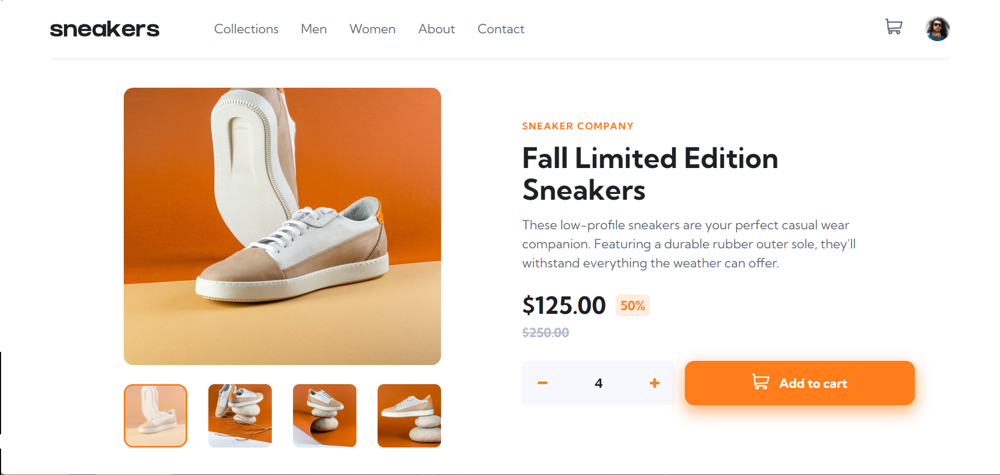

# E-commerce product page

This is a simple E-Commerce Product Page website built using HTML, Tailwind CSS, and JavaScript.

## Screenshots

## Live Site

Check out the live site [here](https://job-l1stings.netlify.app/).

## Features

- **Add to Cart:** Users can add products to their shopping cart by clicking the "Add to Cart" button on the product card. The selected items and quantities are stored in the cart.
- **Quantity Selection:** When adding items to the cart, users can specify the quantity they want to purchase.
- **View Product Image:** Clicking on a product's image displays a larger image of the product, allowing users to get a better view before making a purchase decision.
- **View Cart Summary:** Users can view their cart's current contents, including the list of products, quantities, and the total cost.

## Installation

1. Clone the repository: `git clone https://github.com/your-username/ecommerce-product-page.git`
2. Navigate to the project directory: `cd ecommerce-product-page`
3. Install the dependencies: `npm install`
4. Start the development server: `npm run dev`
5. Open your web browser and visit `http://localhost:3000` (or the specified port)

## Contributing

Contributions are welcome! If you would like to contribute to this project, please follow these steps:

1. Fork the repository.
2. Create a new branch for your feature or bug fix.
3. Commit your changes.
4. Push your branch to your forked repository.
5. Submit a pull request.

## License

This project is licensed under the [MIT License](LICENSE).
